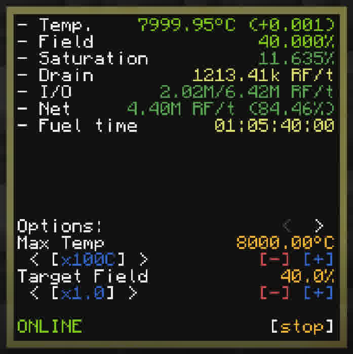
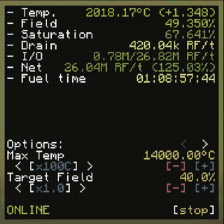

    
     
    <b>drctrl</b>: advanced Draconic Evolution Reactor controller.

## Setup & Requirements

Known working versions:
- 1.20.1

Known incompatible versions:
- 1.7.10 (`string.format` for rounded float precision does not work, causing display issues)

Requirements:
- Advanced Computer
- 2 Flux gate
- Advanced monitor (optional, recommended size 3x3)

To install, run `wget run https://raw.githubusercontent.com/frostice482/drctrl/refs/heads/master/install.lua`. You can also drag and drop the `install.lua` file and run it from there.

To configure peripherals, edit `peripherals_config`. By default:
- Reactor stabilizer: `top`
- Input gate: `back`
- Output gate: `right`
- Monitor: `monitor_0`

To run the controller, simply run `main`. By default, the controller will not start itself again after shutdown, so it is recommended to rename `main` to `startup`.

## Configuration

- Max Temperature

    Configures maximum temperature of the reactor. 8000 is recommended maximum. Higher will cause fuel consumption and field input to increase exponentially.

- Target Field

    Configures target field strength of the reactor. 50% is recommended value. Higher will use more energy. Lower will cause the reactor to prone to field drop because of temperature increase. Ranges from 5% to 99.9%.

- Max Input

    Configures how much energy can be put into the reactor. Reactor's temperature will be limited by how much energy can be put at target field. This should be configured slightly less than the actual input limit. 10M RF/t is default value. Maximum depends on reactor's field strength

- Max Chaos

    Configures how much chaos should be within the reactor's fuel before automatic shutdown. 95% is default and maximum value.

Configuration file is saved to `drctrl_config`.

## Pushing Reactor to its Limit

Drctrl supports pushing reactor to its limits. Note that on some occasion this might just not work and instead causes meltdown.

